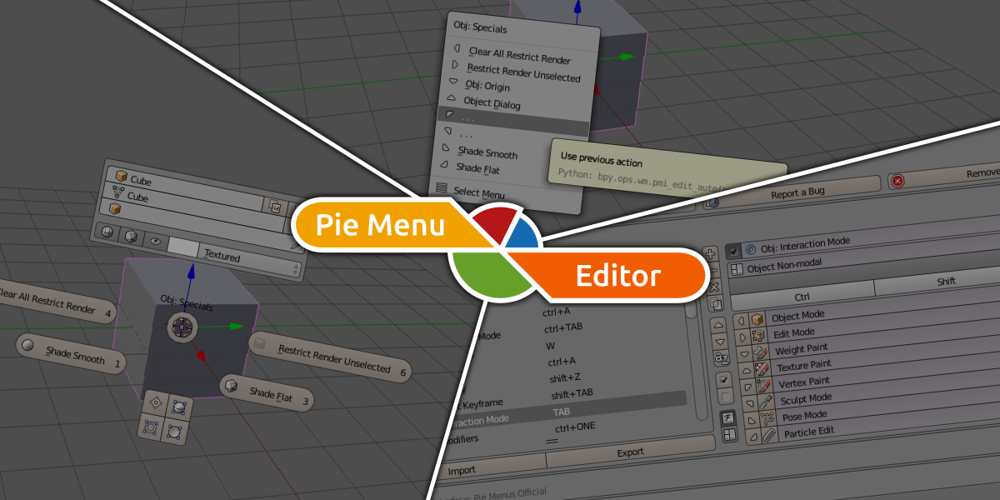

<div class="hero-section">



# Treasure Hunt on BlenderArtists: PME Edition

**5,599 posts** from 10 years of Pie Menu Editor community knowledge, now searchable.

</div>

---

## What are you looking for?

<div class="card-grid">

<div class="nav-card beginner">

### 🌱 I'm new to PME

Start here if you just purchased PME or want to learn the basics.

- [[Guides/getting-started|Getting Started Guide]]
- [What is PME? (Post #1)](Posts/2016/post_00001.md)
- [Official Documentation (Archive)](https://archive.blender.org/wiki/index.php/User:Raa/Addons/Pie_Menu_Editor/)
- [YouTube Tutorials](https://www.youtube.com/playlist?list=PLsowJ3v5QWhE9db_GcPnSrTXWJrA5poWg)

</div>

<div class="nav-card problem">

### 🔧 I have a problem

Find solutions to common issues and errors.

- [[Guides/troubleshooting|Troubleshooting Guide]]
- [Browse Solved Posts](tags/status/solved) (1,379 posts)
- [Hotkey Conflicts](tags/topic/hotkeys/conflicts) (187 posts)
- [Compatibility Issues](tags/topic/compatibility) (74 posts)

</div>

<div class="nav-card code">

### 💻 I need code examples

Scripts, snippets, and advanced customization.

- [[Guides/code-examples|Code Examples Collection]]
- [Scripting Posts](tags/topic/scripting) (293 posts)
- [Python Scripting](tags/topic/python-scripting) (200 posts)
- [Advanced Topics](tags/difficulty/advanced) (406 posts)

</div>

<div class="nav-card explore">

### 🗺️ I want to explore

Browse the archive by different categories.

- [All Tags](_Index/Tag_Index.md)
- [Timeline (2016-2025)](_Index/Timeline.md)
- [Top Contributors](_Index/User_Index.md)
- [By Editor Type](tags/editor)

</div>

<div class="nav-card showcase">

### 🎨 I want to see examples

User-created showcases and real-world PME setups.

- [[Guides/examples|Examples and Showcases]]
- [#5000: Transform Preset](Posts/2024/post_05000.md) - Pie menu with orientation, pivot, snap
- [#5489: Context Browser](Posts/2025/post_05489.md) - Essential tool for PME scripting
- [Browse by Editor Type](tags/editor)

</div>

</div>

---

## Browse by Editor Type

| Editor | Posts | What it does |
|--------|-------|--------------|
| 🥧 [Pie Menu](tags/editor/pie-menu) | 1,820 | Radial menus triggered by hotkeys |
| 📜 Regular Menu | (tagging pending) | Traditional dropdown menus |
| ⚡ [Macro](tags/editor/macro) | 767 | Chain multiple operations into one |
| 📋 [Popup Dialog](tags/editor/popup-dialog) | 723 | Custom dialog windows with controls |
| 📐 [Panel Group](tags/editor/panel-group) | 82 | Organize N-panel/sidebar panels |
| 🔑 [Stack Key](tags/editor/stack-key) | 78 | Multiple commands on one key |
| 🎯 [Modal Operator](tags/editor/modal) | 86 | Interactive tools with real-time feedback |
| 🖱️ [Sticky Key](tags/editor/sticky-key) | 25 | Hold-to-activate menus |
| ⚙️ [Property Editor](tags/editor/property) | 50 | Custom properties and sliders |

---

## Featured Content

### 📌 Essential Posts

These posts are highly rated and contain valuable information:

| Post | Author | Topic |
|------|--------|-------|
| [#1: PME Introduction](Posts/2016/post_00001.md) | roaoao | Complete feature overview |
| [#5660: PME 1.19.1 Release](Posts/2025/post_05660.md) | Pluglug | Release context from 2025 |
| [#5648: Undo Stack Issue](Posts/2025/post_05648.md) | Pluglug | Advanced macro troubleshooting |

> 📚 **[Curated Posts by Pluglug](Guides/curated-posts.md)** - Hand-picked posts with explanations of why each is worth reading. Great for Q&A-style learning!

### 👤 Key Contributors

- **[roaoao](Users/roaoao.md)** (1,353 posts) - Original PME developer
- **[Pluglug](Users/Pluglug.md)** (363 posts) - PME-F fork maintainer
- **[Jakro](Users/Jakro.md)** (37 posts) - Author of popular tutorials

---

## Quick Statistics

| Category | Count |
|----------|-------|
| Total Posts | 5,599 |
| Solved Issues | 1,379 |
| Unsolved Issues | 2,016 |
| Contributors | 380 |
| Years of History | 10 (2016-2025) |

### Difficulty Distribution

```
Beginner      ████████████████░░░░  1,868 posts
Intermediate  █████████████████████  2,303 posts
Advanced      ████░░░░░░░░░░░░░░░░    406 posts
```

---

## PME Versions

This archive covers multiple PME versions:

| Version Range | Era | Notes |
|--------------|-----|-------|
| v1.0 - v1.14 | 2016-2019 | Blender 2.79 era |
| v1.15 - v1.18 | 2019-2022 | Blender 2.80+ transition |
| v1.19 - v1.20 | 2023-2025 | Blender 3.x/4.x compatibility |
| PME-F | 2024+ | Community fork by Pluglug |

---

## For AI Tools

This knowledge base is optimized for use with AI assistants:

- **Full-text search** works great with Claude, ChatGPT, etc.
- **JSON export** available for programmatic access
- **Structured tags** help filter relevant content

> **Tip**: Copy the URL of any post and ask your AI assistant to analyze it!

---

## External Links

### 🛍️ Get PME

- 🛒 [PME on Gumroad](https://gum.co/pie_menu_editor) - Purchase the original addon
- 🏪 [PME on SuperHive Market](https://superhivemarket.com/products/pie-menu-editor) - Alternative marketplace

### 🔀 PME-F (Community Fork)

- [GitHub Repository](https://github.com/Pluglug/pie-menu-editor-fork) - Source code & downloads
- [Issues](https://github.com/Pluglug/pie-menu-editor-fork/issues) - Bug reports & feature requests
- [Releases](https://github.com/Pluglug/pie-menu-editor-fork/releases) - Download latest version
- [Pull Requests](https://github.com/Pluglug/pie-menu-editor-fork/pulls) - Contributions

### 📖 Resources

- 📕 [PME Documentation](https://pluglug.github.io/pme-docs/) - Official documentation (WIP)
- 💬 [Blender Artists Thread](https://blenderartists.org/t/pie-menu-editor-1-18-8/662456) - Original forum
- 📚 [Archived Documentation](https://archive.blender.org/wiki/index.php/User:Raa/Addons/Pie_Menu_Editor/) - Legacy docs (Blender 2.79 era)

### ☕ Support

- [Ko-fi (Pluglug)](https://ko-fi.com/pluglug) - Support PME-F development

---

## Contributing

Found an incorrectly tagged post? Want to suggest improvements?

- 🐛 [Report Issues](https://github.com/Pluglug/ba-pme-treasure/issues) - Report tagging errors, broken links, or suggestions
- 🔧 [Pull Requests](https://github.com/Pluglug/ba-pme-treasure/pulls) - Submit corrections directly

> **Note**: Tags were auto-generated using AI classification. Some posts may have incorrect or missing tags. Your contributions help improve the accuracy of this archive!

### 📋 Planned Improvements

The following improvements are planned for this archive:

- [ ] **AI Re-analysis**: Re-run AI classification with improved prompts to fix tagging errors
- [ ] **Regular Menu tagging**: Add `#editor/regular-menu` tag to posts discussing Regular Menu Editor
- [ ] **Tag cleanup**: Review and correct commonly misapplied tags
- [ ] **Guide expansion**: Add more detailed guides based on user feedback

---

<div class="footer-note">

*Built with [Quartz](https://quartz.jzhao.xyz/) | Data extracted from Blender Artists forum*

*Use `Ctrl+K` / `Cmd+K` to search*

</div>
